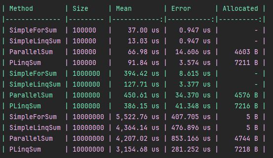

# 15. Многопоточный проект

## Цель:

Применение разных способов распараллеливания задач и оценка оптимального способа реализации.

## Описание/Пошаговая инструкция выполнения домашнего задания:

1. Напишите вычисление суммы элементов массива интов:
    * Обычное
    * Параллельное (для реализации использовать Thread, например List)
    * Параллельное с помощью LINQ

2. Замерьте время выполнения для 100 000, 1 000 000 и 10 000 000

3. Укажите в таблице результаты замеров, указав:
    * Окружение (характеристики компьютера и ОС)
    * Время выполнения последовательного вычисления
    * Время выполнения параллельного вычисления
    * Время выполнения LINQ

Пришлите в чат с преподавателем помимо ссылки на репозиторий номера своих строк в таблице.

## Критерии оценки:

* 5 баллов: Сделан пункт 1;
* 2 балла: Сделан пункт 2;
* 2 балла: Сделан пункт 3;
* 1 балла: Добавлены замеры в таблицу;

## Решение

BenchmarkDotNet v0.15.0, Windows 11 (10.0.26100.4061/24H2/2024Update/HudsonValley)

.NET SDK 9.0.201    

    * [Host]     : .NET 9.0.3 (9.0.325.11113), X64 RyuJIT AVX2 [AttachedDebugger]
    * Job-XCMRDH : .NET 9.0.3 (9.0.325.11113), X64 RyuJIT AVX2

- IterationCount=5
- WarmupCount=2

| Method        | Size     | Mean        | Error      | Allocated |
|-------------- |--------- |------------:|-----------:|----------:|
| SimpleForSum  | 100000   |    37.00 us |   0.947 us |         - |
| **SimpleLinqSum** | **100000**   |    **13.03 us** |   **0.947 us** |         - |
| ParallelSum   | 100000   |    66.98 us |  14.606 us |    4603 B |
| PLinqSum      | 100000   |    91.84 us |   3.574 us |    7211 B |
|               |          |             |            |           |
| SimpleForSum  | 1000000  |   394.42 us |   8.615 us |         - |
| **SimpleLinqSum** | **1000000**  |   **127.71 us** |   **3.377 us** |         - |
| ParallelSum   | 1000000  |   450.61 us |  34.370 us |    4576 B |
| PLinqSum      | 1000000  |   386.15 us |  41.348 us |    7216 B |
|               |          |             |            |           |
| SimpleForSum  | 10000000 | 5,522.76 us | 407.705 us |       5 B |
| SimpleLinqSum | 10000000 | 4,364.14 us | 476.896 us |       5 B |
| ParallelSum   | 10000000 | 4,207.02 us | 853.166 us |    4744 B |
| **PLinqSum**      | **10000000** | **3,154.68 us** | **281.252 us** |    7218 B |

