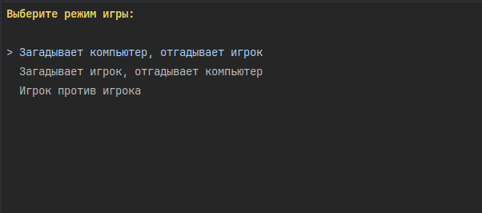
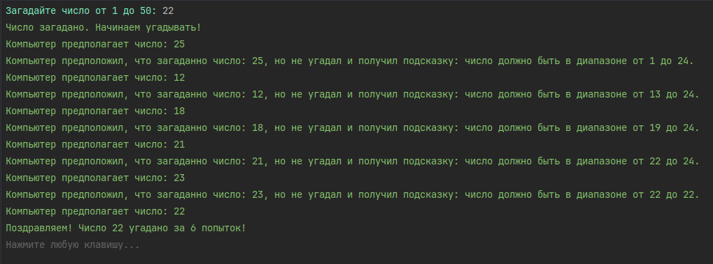

# 22. Демонстрация SOLID принципов

## Цель:

Практическое применение SOLID принципов.

## Описание/Пошаговая инструкция выполнения домашнего задания:

На примере реализации игры «Угадай число» продемонстрировать практическое применение SOLID принципов.
Программа рандомно генерирует число, пользователь должен угадать это число.
При каждом вводе числа программа пишет больше или меньше отгадываемого. Кол-во попыток отгадывания и диапазон чисел должен задаваться из настроек.
В отчёте написать, что именно сделано по каждому принципу.
Приложить ссылку на проект и написать, сколько времени ушло на выполнение задачи.


## Критерии оценки:

2 балла: Принцип единственной ответственности;
1 балла: Принцип инверсии зависимостей;
2 балла: Принцип разделения интерфейса;
2 балла: Принцип открытости/закрытости;
2 балла: Принцип подстановки Барбары Лисков;
1 балл: CodeStyle, грамотная архитектура, всё замечания проверяющего исправлены.

Минимально необходимый балл: 6.

## Решение

### Структура проекта "Угадай число"

#### 📁 Корневая структура

```
HomeWorks/22.HomeWork.05/
├── 📄 HomeWork.05.sln              # Solution файл Visual Studio
├── 📄 global.json                  # Настройки .NET SDK версии
├── 📄 README.md                    # Описание задания и требования
└── 📁 HomeWork.05/                 # Основной проект
    ├── 📄 HomeWork.05.csproj       # Файл проекта с зависимостями
    ├── 📄 Program.cs               # Точка входа приложения
    ├── 📁 Configuration/           # Конфигурационные файлы
    ├── 📁 Core/                    # Ядро приложения (абстракции и модели)
    ├── 📁 Services/                # Реализации сервисов
    ├── 📁 Extensions/              # Расширения для DI контейнера
    └── 📁 Settings/                # Настройки приложения
```

### Архитектурные слои

#### 📂 Core/ - Ядро приложения

##### 📂 Core/Abstractions/ - Интерфейсы и контракты

**📁 Game/** - Игровая логика
- `IGameCalculator.cs` - Расчет игровых параметров
- `IGameEngine.cs` - Движок игры
- `IGameMenu.cs` - Главное меню
- `IGameResultEvaluator.cs` - Оценка результатов
- `IRoundManager.cs` - Управление раундами

**📁 Players/** - Игроки
- `INumberGuesser.cs` - Интерфейс угадывающего
- `INumberRiddler.cs` - Интерфейс загадывающего
- `IPlayer.cs` - Универсальный игрок
- `IPlayerFactory.cs` - Фабрика игроков
- `PlayerBase.cs` - Базовый класс игроков

**📁 UI/** - Пользовательский интерфейс
- `IPlayerInterface.cs` - Интерфейс взаимодействия с игроком

**📁 Utils/** - Утилиты
- `INumberGenerator.cs` - Генератор случайных чисел

##### 📂 Core/Models/ - Модели данных

- `GameMode.cs` - Режимы игры (enum)
- `GameRoundResult.cs` - Результат игрового раунда
- `GuessOutcome.cs` - Результат попытки (enum)
- `GuessResult.cs` - Обертка результата угадывания
- `NumberRange.cs` - Value object для диапазона чисел

#### 📂 Services/ - Реализации сервисов

##### 📁 Game/ - Игровые сервисы
- `GameCalculator.cs` - Вычисление игровых параметров
- `GameEngine.cs` - Основной движок игры
- `GameMenu.cs` - Реализация главного меню
- `GameResultEvaluator.cs` - Оценка результатов попыток
- `RoundManager.cs` - Управление игровыми раундами

##### 📁 Players/ - Реализации игроков
- `ComputerPlayer.cs` - Компьютерный игрок с ИИ
- `HumanPlayer.cs` - Человеческий игрок
- `PlayerFactory.cs` - Фабрика для создания игроков

##### 📁 UI/ - Пользовательский интерфейс
- `SpectreConsoleInterface.cs` - Консольный UI на Spectre.Console

##### 📁 Utils/ - Утилиты
- `NumberGenerator.cs` - Генератор случайных чисел

#### 📂 Configuration, Extensions, Settings

- `📁 Configuration/appsettings.json` - Настройки приложения
- `📁 Extensions/GameInstaller.cs` - Конфигурация DI контейнера
- `📁 Settings/GameSettings.cs` - Класс настроек игры

### Демонстрация работы







## Применение принципов SOLID

### Single Responsibility Principle (SRP)
- `GameCalculator` - только вычисления
- `RoundManager` - только управление раундами  
- `PlayerFactory` - только создание игроков
- `GameResultEvaluator` - только оценка результатов

### Open/Closed Principle (OCP)
- Новые типы игроков через интерфейсы `IPlayer`
- Новые UI реализации через `IPlayerInterface`
- Расширяемые стратегии через `INumberGuesser`

### Liskov Substitution Principle (LSP)
- Все реализации `IPlayer` взаимозаменяемы
- `ComputerPlayer` и `HumanPlayer` корректно заменяют базовые типы

### Interface Segregation Principle (ISP)
- `INumberGuesser` - только угадывание
- `INumberRiddler` - только загадывание
- `IPlayer` - комбинированный интерфейс

### Dependency Inversion Principle (DIP)
- Все зависимости направлены на абстракции
- DI контейнер управляет созданием объектов
- Слабая связанность между компонентами